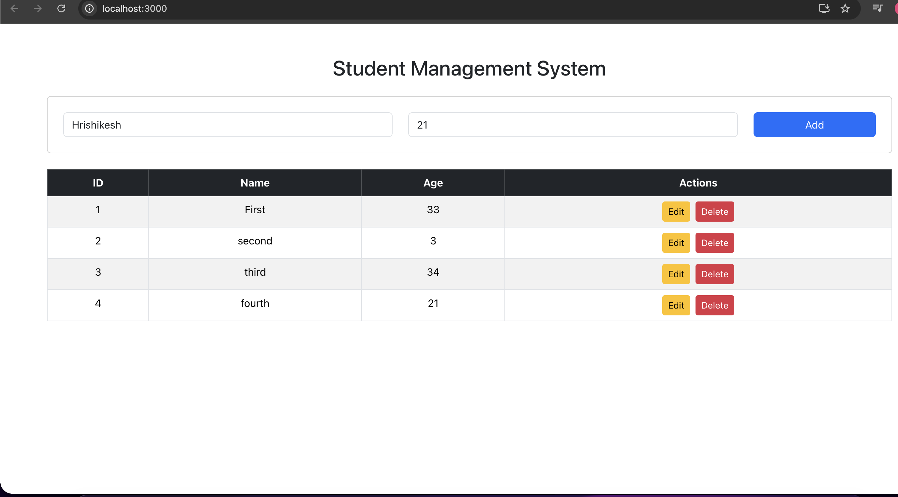
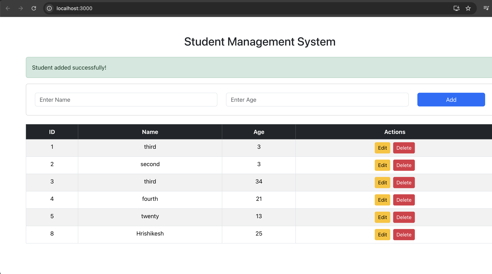
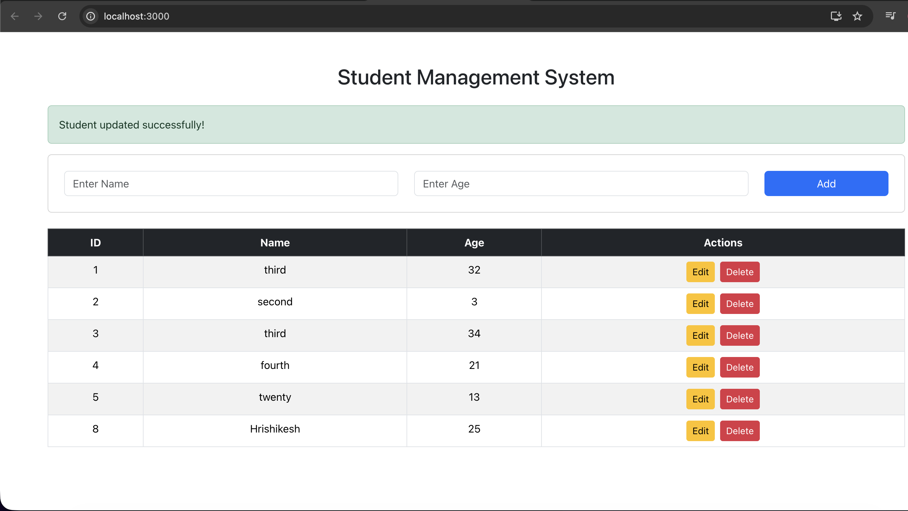
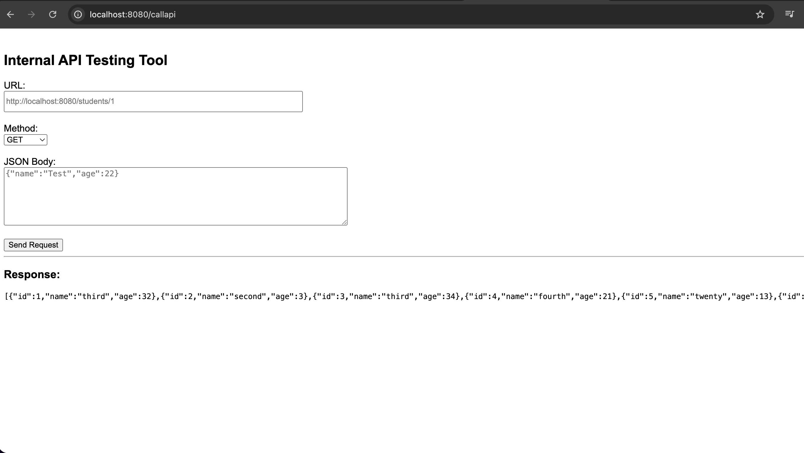

# Student Management System (Full Stack)

A full-stack web application for managing student records with complete CRUD functionality. Built using Spring Boot, MySQL, and React, and includes a custom API testing tool for backend debugging.

---

## Screenshots

### Student Management UI

  

### Add Student Form

  

### Update Student

  

### API Testing Tool

  

---

## Features

- Create, update, delete, and view student records  
- RESTful API with full CRUD operations  
- MySQL database integration using JPA/Hibernate  
- React-based frontend with interactive UI  
- Custom-built API testing tool (similar to Postman)  
- Input validation and error handling  

---

## Tech Stack

Backend:
- Java  
- Spring Boot  
- Spring Data JPA  
- Hibernate  

Frontend:
- React.js  
- Bootstrap  

Database:
- MySQL  

Tools:
- Git, GitHub  
- Eclipse IDE  

---

## Project Structure

studentapp/  
 ├── src/main/java/com/example  
 ├── src/main/resources/templates  
 ├── screenshots/  
 ├── .gitignore  
 ├── pom.xml  

---

## Setup Instructions

1. Clone the repository

git clone https://github.com/Hrishikeshadsod/studentapp.git  
cd studentapp  

---

2. Configure database

CREATE DATABASE studentdb;

Update application.properties:

spring.datasource.username=root  
spring.datasource.password=yourpassword  

---

3. Run the application

Using Eclipse:  
Run As → Java Application  

Using terminal:  
./mvnw spring-boot:run  

---

## API Endpoints

| Method | Endpoint | Description |
|------|---------|------------|
| GET | /students | Get all students |
| POST | /students | Add new student |
| PUT | /students/{id} | Update student |
| DELETE | /students/{id} | Delete student |

---

## API Testing Tool

http://localhost:8080/apitool  

---

## Security

Sensitive configuration files are excluded using .gitignore.

---

## Author

Hrishikesh Adsod